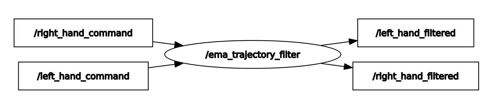

[](https://github.com/arthurgomes4)
# ROS_filters

ROS package/s for implementing various filters.

## Filter Nodes
* [Exponential Moving Average](#exponential-moving-average)
    * [Float64 messages](#float64-messages)
    * [Joint Trajectory messsages](#joint-trajectory-messages)
* [Low Pass](#)

## Exponential moving average
This filter is used to smoothen sudden changes in data.
<p align="left">
    
</p>

**Note:** The smoothing Factor (alpha) is inversely proportional to the amount of smoothing. **Value between 0 and 1**.

* ## Float64 messages
    The executable `ema_filter` provides a node that can subscribe to any number of topics of type `std_msgs/Float64`. The topic names for raw input and filtered output are stored in the parameter server.

    ### Usage

    Give topic names and smoothing Factors for each topic in the private parameters of the `ema_filter_node` or whichever name the node is given. This can be done from the launch file itself.

    ```
    <launch>
        <node name="ema_filter" pkg="basic_filters" type="ema_filter_node" output="screen">
            <rosparam>
                inputTopics: [joint1_command, 
                                joint2_command, 
                                joint3_command, 
                                joint4_command,
                                joint5_command,
                                joint6_command,
                                joint7_command,
                                joint8_command]

                outputTopics: [joint1_filtered,
                                joint2_filtered,
                                joint3_filtered,
                                joint4_filtered,
                                joint5_filtered,
                                joint6_filtered,
                                joint7_filtered,
                                joint8_filtered]

                smoothingFactors: [0.5, 0.5, 0.5, 0.5, 0.5, 0.5, 0.5, 0.5]
            </rosparam>
        </node>
    </launch>
    ```

    **OR** a .yaml file can be loaded into the nodes private parameters.

    ```
    <launch>
        <node name="ema_filter" pkg="basic_filters" type="ema_filter_node" output="screen">
            <rosparam command="load" textfile="$(find basic_filters)/<sample_file>.yaml">
        </node>
    </launch>
    ```

    Run the node with: `roslaunch basic_filters ema_filter.launch`.

    <p align="center">
        
    </p>

* ## Joint Trajectory Messages
    The executable `ema_trajectory_filter` provides a node that can subscribe to any number of topics of type `trajectory_msgs/JointTrajectory`. The topic names for raw input and filtered output are stored in the parameter server.

    **Note:** Only the first `JointTrajectoryPoint` in the `JointTrajectoryPoint[] points` array is processed with only `float64[] positions` being filtered. For reference the structure of the message looks like this:
    ```
    header: 
        seq: 1985
        stamp: 
            secs: 1670655451
            nsecs:  83537340
        frame_id: ''
    joint_names: 
        - left_elbow
        - left_shoulder_1
        - left_shoulder_2
        - left_wrist
    points: 
        - 
            positions: [0.07516506314277649, 0.2883884012699127, 0.5046796798706055, 0.2208932340145111]
            velocities: []
            accelerations: []
            effort: []  
            time_from_start: 
            secs: 1
            nsecs:         0
    ``` 

    ### Usage

    Give topic names and smoothing Factors for each topic in the private parameters of the `ema_filter_node` or whichever name the node is given. This can be done from the launch file itself.

    ```
    <launch>
        <node name="ema_trajectory_filter" pkg="basic_filters" type="ema_trajectory_filter_node" output="screen">
            <rosparam>
                inputTopics: [left_hand_command,
                                right_hand_command]

                outputTopics: [left_hand_filtered,
                                right_hand_filtered]

                smoothingFactors: [[0.6, 0.6, 0.6, 0.6], [0.6, 0.6, 0.6, 0.6]]
            </rosparam>
        </node>
    </launch>
    ```

    **OR** a .yaml file can be loaded into the nodes private parameters.

    Run the node with: `roslaunch basic_filters ema_trajectory_filter.launch`.

    <p align="center">
        
    </p>


[](https://github.com/arthurgomes4)