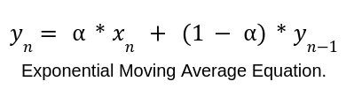
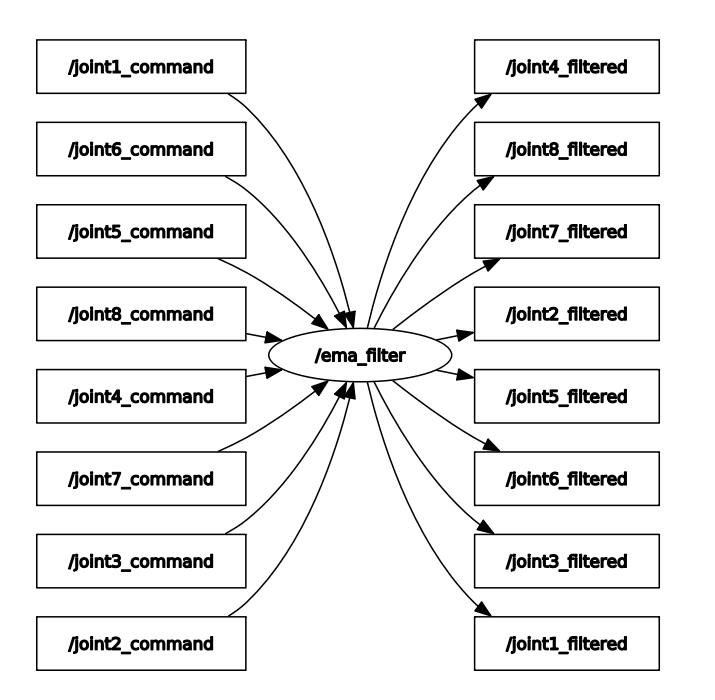
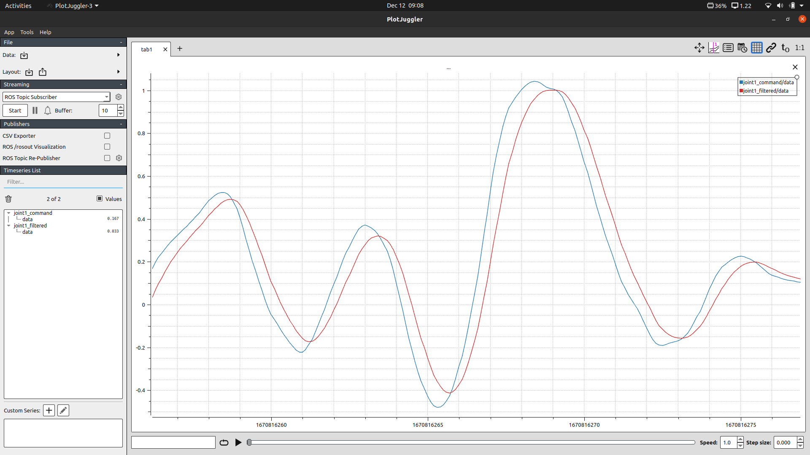

[](https://github.com/arthurgomes4)
# ROS_filters

ROS package/s for implementing various filters.

## Implemented Filters
* [Exponential Moving Average](#exponential-moving-average)
* [Low Pass]()

## Exponential moving average
This filter is used to smoothen sudden changes in data.
<p align="center">
    
</p>

### Usage
The node can subscribe to any number of topics with message type `std_msgs/Float64`. The topic names for raw input and filtered output are stored in the parameter server. 

Give topic names and smoothing Factors for each topic in the private parameters of the `ema_filter_node`. This can be done from the launch file itself.

**Note:** The smoothing Factor (alpha) is inversely proportional to the amount of smoothing. **Value between 0 and 1**.
```
<launch>
    <node name="ema_filter" pkg="basic_filters" type="ema_filter_node" output="screen">
        <rosparam>
            inputTopics: [joint1_command, 
                            joint2_command, 
                            joint3_command, 
                            joint4_command,
                            joint5_command,
                            joint6_command,
                            joint7_command,
                            joint8_command]

            outputTopics: [joint1_filtered,
                            joint2_filtered,
                            joint3_filtered,
                            joint4_filtered,
                            joint5_filtered,
                            joint6_filtered,
                            joint7_filtered,
                            joint8_filtered]

            smoothingFactors: [0.5, 0.5, 0.5, 0.5, 0.5, 0.5, 0.5, 0.5]
        </rosparam>
    </node>
</launch>
```

**OR** a .yaml file can be loaded into the nodes private parameters.

```
<launch>
    <node name="ema_filter" pkg="basic_filters" type="ema_filter_node" output="screen">
        <rosparam command="load" textfile="$(find basic_filters)/<sample_file>.yaml">
    </node>
</launch>
```

Run the node with `roslaunch basic_filters ema_filter.launch`.
### Graph
<p align="center">

</p>

### Result
<p align="center">

</p>

[](https://github.com/arthurgomes4)